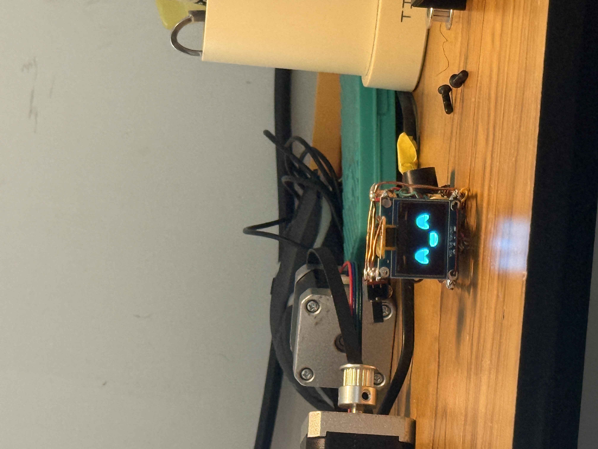
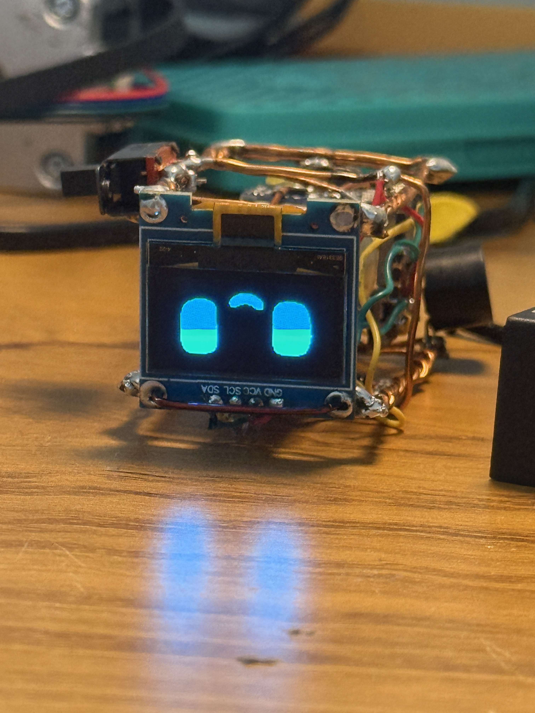

# -DIY-Desi-Mochi-Robot-
Meet the Desi Mochi Robot by Jayabeer Sutar! A charming DIY companion with a unique, handcrafted copper wire body. Powered by an ESP32-C3, it responds to touch with animated expressions on its OLED face and cheerful buzzer sounds. A creative, low-cost take on interactive robotics inspired by the original Mochi.
# Desi Mochi Robot 🤖

A cute, interactive, and completely DIY companion robot made from a Xiao ESP32-C3 and a sculpted copper wire body. Mochi reacts to your touch with expressions and sounds!

!

This project is a perfect example of a low-cost, "Desi" (homegrown/DIY) approach to robotics, blending simple electronics with handmade artistry.

## ✨ Features

* **Interactive Touch:** Pat Mochi on its head (TP touch sensor) to see it react.
* **Expressive Face:** A 0.92" OLED screen serves as Mochi's face, showing different animations.
* **Sound Feedback:** A buzzer provides simple audio cues for interactions.
* **Handmade Body:** The unique body is crafted from copper wire, making each Mochi one-of-a-kind.
* **Rechargeable:** Powered by a 3.7V Li-ion battery with a TP4056 charging module.

---

## 🛠️ Components & Bill of Materials (BOM)

| Component                     | Quantity | Notes                                      |
| ----------------------------- | :------: | ------------------------------------------ |
| Seeed Studio Xiao ESP32-C3    |    1     | The brain of the robot.                    |
| 0.92" I2C OLED Display (SSD1306)|    1     | 128x32 or 128x64 resolution works.         |
| TTP223 Capacitive Touch Sensor|    1     | The 'head' or touch-sensitive area.        |
| Buzzer Module (Active or Passive)|    1     | For making sounds.                         |
| 3.7V Li-ion Battery           |    1     | Any small Li-ion or LiPo cell will do.     |
| TP4056 Charging Module        |    1     | For safely charging the battery via USB.   |
| Copper Wire (1.5mm-2mm gauge) |    ~     | For sculpting the body and legs.           |
| Connecting Wires              |  Several | To wire everything together.               |

---

## 🔌 Wiring Diagram

Connect the components to the Xiao ESP32-C3 as follows.

* **OLED Display (I2C):**
    * `VCC` -> `3V3`
    * `GND` -> `GND`
    * `SDA` -> `D4`
    * `SCL` -> `D5`
* **Touch Sensor (TTP223):**
    * `VCC` -> `3V3`
    * `GND` -> `GND`
    * `I/O` or `SIG` -> `D1`
* **Buzzer:**
    * `+` or `VCC` -> `D2`
    * `-` or `GND` -> `GND`
* **Power:**
    * Connect the `B+` and `B-` terminals of the TP4056 charger to the battery.
    * Connect the `OUT+` and `OUT-` terminals of the TP4056 to the `5V` and `GND` pins on the Xiao ESP32-C3.

# Desi Mochi Robot 🤖

A cute, interactive, and completely DIY companion robot made from a Xiao ESP32-C3 and a sculpted copper wire body. Mochi reacts to your touch with expressions and sounds!

This project is a perfect example of a low-cost, "Desi" (homegrown/DIY) approach to robotics, blending simple electronics with handmade artistry.

## 🖼️ Gallery

## ✨ Features
* **Interactive Touch:** Pat Mochi on its head (TP touch sensor) to see it react.
* **Expressive Face:** A 0.92" OLED screen serves as Mochi's face, showing different animations.
* **Sound Feedback:** A buzzer provides simple audio cues for interactions.
* **Handmade Body:** The unique body is crafted from copper wire, making each Mochi one-of-a-kind.
* **Rechargeable:** Powered by a 3.7V Li-ion battery with a TP4056 charging module.

---
---

## 🚀 Setup & Installation

1.  **Configure Arduino IDE:**
    * Install the Arduino IDE if you haven't already.
    * Add the ESP32 board manager URL to `Preferences`: `https://raw.githubusercontent.com/espressif/arduino-esp32/gh-pages/package_esp32_index.json`
    * Go to `Tools > Board > Boards Manager`, search for "esp32" and install it.
    * Select `Seeed Studio Xiao ESP32-C3` as your board.

2.  **Install Libraries:**
    * Go to `Sketch > Include Library > Manage Libraries...`.
    * Search for and install the **U8g2** library by `oliver`.

3.  **Upload the Code:**
    * Clone this repository or download the source code.
    * Open the `.ino` file from the `src` folder in the Arduino IDE.
    * Connect your Xiao ESP32-C3, select the correct COM port, and click the "Upload" button.

---

## 🙏 Acknowledgements and Inspiration

This "Desi Mochi Robot" project was heavily inspired by the original Mochi robot created by Huy Khong. His work provided the core idea and motivation for this DIY version.

Please check out the original project here: [https://themochi.huykhong.com/](https://themochi.huykhong.com/)

---

## 📄 License

This project is open source and licensed under the MIT License. See the `LICENSE` file for details.
